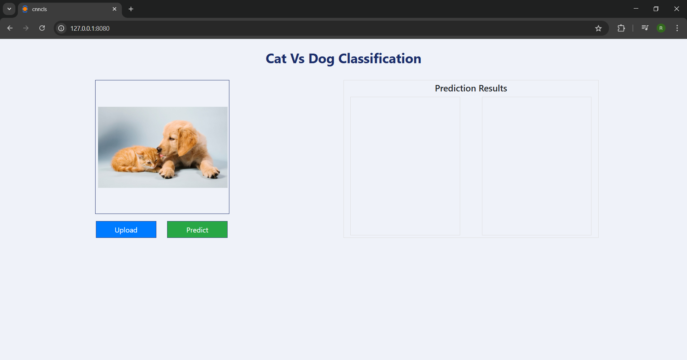

# Cats vs. Dogs Image Classifier with Convolutional Neural Networks (CNN) #
<hr>

<hr>

## Project Objectives ##

## This is the End to End implementation of Cat and Dog classification, developing the model locally and deploying the project as a web application on Amazon Web Service (AWS)

### -Modular coding using Python with step by step pipeline execution

### -using Frontend development, HTML5, CSS3, Bootstrap, JavaScript, and Flask for backend integration.

### -Containarization of the code using Docker

### -AWS CI/CD Deployment using GitHub Actions

<hr>

### screenshots of the web application


<hr>

<hr>

<hr>

<hr>

### Dataset url:
<a href="https://github.com/entbappy/Branching-tutorial/raw/master/cat-dog-data.zip">Cat_and_Dog</a>


<hr>

## How to run?

## Steps:

## clone the repository:

``` bash
https://github.com/entbappy/cnnClassifier

```
## STEP 01- Create a conda environment after opening the repository

``` bash
conda create -n cnncls python=3.10 -y
```
```bash
conda activate cnncls
```

## STEP 02- install the requirements

```bash
pip install -r requirements.txt
```
```bash
#run the following command
python app.py
```

# AWS CICD Deployment with Github Actions

### 1. Login to AWS console.

### 2. Creating IAM user for deployment

```bash

#with specific access

1. EC2 access : It is a virtual machine

2. ECR: Elastic Container registry to save your docker image in AWS


# About the deployment

1. Building docker image of the source code

2. Pushing docker image to ECR

3. Launching Your EC2 

4. Pulling image from ECR in EC2

5. Lauching docker image in EC2

#Policy:

1. AmazonEC2ContainerRegistryFullAccess

2. AmazonEC2FullAccess
```


### 3. Create ECR repo to store/save docker image

```bash
- Save the URI: 646741850091.dkr.ecr.eu-north-1.amazonaws.com/catdog 
```
### 4. Create EC2 machine (Ubuntu)

### 5. Open EC2 and Install docker in EC2 Machine:

```bash
#optinal

sudo apt-get update -y

sudo apt-get upgrade

#required

curl -fsSL https://get.docker.com -o get-docker.sh

sudo sh get-docker.sh

sudo usermod -aG docker ubuntu

newgrp docker
```
### 6. Configure EC2 as self-hosted runner:
```bash
setting>actions>runner>new self hosted runner> choose os> then run command one by one
```
### setup ypur own github secrets for future access 
```bash
AWS_ACCESS_KEY_ID=

AWS_SECRET_ACCESS_KEY=

AWS_REGION = eu-north-1

AWS_ECR_LOGIN_URI = demo>>  566373416292.dkr.ecr.ap-south-1.amazonaws.com

ECR_REPOSITORY_NAME = simple-app
```

<hr>

# Initial testing of CNN Classification for the project

## The file Cat and Dog Classification using cnn notebook contains a deep learning project that classifies images of cats and dogs using a Convolutional Neural Network (CNN) built with TensorFlow and Keras.The project is structured as a Google Colab notebook, allowing for easy execution and step-by-step learning without the need for local setup of a deep learning environment. ##

<hr>

## Description of the Testing on Notebook

### The main goals of this project are: ###

-Data Preparation: Download and organize the Cats vs. Dogs dataset, splitting it into training and validation sets.

-Data Augmentation: Implement data augmentation techniques to prevent overfitting and improve the model's ability to generalize to new images.

-Model Building: Construct a CNN from scratch with multiple convolutional, pooling, and dense layers.

Training and Evaluation: Train the model and evaluate its performance using accuracy and loss metrics, with a focus on monitoring for overfitting.

Prediction: Create a function to make predictions on new, unseen images.

## Model Architecture


-The CNN architecture is a sequential model designed for image classification. It consists of the following layers:

-Input Layer: A Conv2D layer with 32 filters, followed by MaxPooling2D.

-Hidden Layers: Three additional blocks of Conv2D and MaxPooling2D layers, progressively increasing the number of filters to 64, 128, and 128 respectively, to learn more complex features.

-Flatten Layer: A Flatten layer to convert the 3D output of the convolutional layers into a 1D vector.

-Fully Connected Layers: A Dense layer with 512 units and a ReLU activation function.

-Output Layer: A final Dense layer with a sigmoid activation function to output a single probability score for the "dog" class.

-The model is compiled with the binary_crossentropy loss function and the RMSprop optimizer.

## Getting Started ##

### To run this project, you will need a Google account to access Google Colab. they provide free TPU's can be used for exection. comes with most of libraries pre-installed ###

## How to Run the Code ##

-Open the Notebook: Copy and paste the code from the cats_vs_dogs_cnn.py file into a new Google Colab notebook. 

-Execute Cells: Run each code cell sequentially. The notebook is structured to guide you through each step of the process.

-Data Download: The notebook automatically downloads a pre-structured version of the dataset, so you do not need to manually handle the Kaggle API key setup.

-Training: The model will begin training for 15 epochs. This may take some time, depending on the Colab environment's performance. 

-Prediction: After training, the final cell will make predictions on two example images (one cat, one dog) downloaded from the web. You can easily modify this to test your own images by uploading them to Colab.

-Interpreting the Results
The model's performance can be evaluated by examining the generated plots for accuracy and loss.

-Accuracy: The goal is to see both training and validation accuracy increase over time. If the training accuracy continues to rise while the validation accuracy flattens or decreases, the model is overfitting and may not perform well on new data.

-Loss: Similarly, the goal is for both training and validation loss to decrease. If the validation loss begins to increase while the training loss decreases, this is another strong indicator of overfitting.

### Based on the provided code with 30 epochs, you will likely observe a clear case of overfitting, where the validation accuracy and loss plateau after about 15 epochs. This demonstrates a key challenge in machine learning and the importance of monitoring these plots to determine the optimal number of training epochs. Change epochs training to 15 wanna keep it minimal error ###

## the model accuracy can be seen around 72 percentage, the project can be updated using more data for more accuracy and using opencv for live object detection classification whether its a cat or dog

### License
### This project is licensed under the MIT License.

